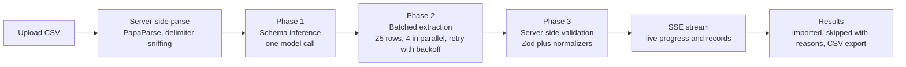

# GrowEasy CSV Importer

An AI-powered importer that takes a lead CSV in any layout, from any tool, and turns it into
clean, validated GrowEasy CRM records. Upload a Facebook Leads export, a real-estate CRM dump or
a hand-made spreadsheet; the system works out which column is which, cleans every row, and
streams the results back live.

### Demo

https://github.com/user-attachments/assets/68c84078-4243-4c73-85dd-7d3101548503

> **Live app:** https://csv-to-crm-ai-pipeline-frontend.vercel.app/
> 
> **Demo Video Link:** https://youtu.be/u4DVNBgRr6g
> 
> **Repo:** https://github.com/ritiklakhwani/csv-to-crm-ai-pipeline

## The problem

Parsing CSV is trivial. The hard part is that every source names its columns differently:
Facebook says `full_name`, a real-estate CRM says `Client`, a manual sheet crams
"Name & Contact" into one cell, dates arrive as `13/05/2026` or unix milliseconds, and phone
numbers may or may not carry a country code. The importer has to map all of that onto 15 fixed
CRM fields without inventing data, and without a human ever editing a mapping by hand.

## How it works




### Phase 1: schema inference, one call per file

The model sees the header row and a representative sample of rows, and returns a typed mapping
plan: every source column resolved to a CRM field with a confidence score, composite columns
("Name & Contact") with instructions on how to split them, the detected date format, and the
default country code. The date format matters most: `05/13/2026` is ambiguous in one row but not
across a whole sample. This plan is injected into every extraction batch, so a batch that only
sees 25 rows still inherits whole-file context.

### Phase 2: batched extraction

Rows are chunked (25 per batch, env-tunable) and run 4 at a time under a concurrency limiter at
temperature 0. Output is constrained by a JSON schema at decode time (OpenAI Structured Outputs
validated by the same Zod schema), so the model cannot emit a value outside the CRM shape or the
`crm_status` and `data_source` whitelists. Each prompt carries three few-shot examples: a clean
row, a messy row with two phone numbers and a DD/MM/YYYY date, and a row that must be skipped.
The system prompt is byte-identical across calls so the provider's prefix cache absorbs the
roughly 1.5k-token preamble; the first batch is dispatched alone to warm that cache before the
rest fan out.

A trimmed excerpt of the actual extraction prompt (`backend/src/services/extraction/prompts.ts`):

```text
crm_status
  Exactly one of: GOOD_LEAD_FOLLOW_UP | DID_NOT_CONNECT | BAD_LEAD | SALE_DONE
  or "" when nothing matches confidently. Never invent a fifth value. Map semantically:
    GOOD_LEAD_FOLLOW_UP  hot, warm, interested, callback, follow up, site visit done ...
    DID_NOT_CONNECT      no answer, switched off, busy, ringing, unreachable ...
    BAD_LEAD             junk, spam, not interested, invalid, duplicate, wrong number ...
    SALE_DONE            closed won, converted, booked, token received ...

TWO ABSOLUTE RULES

1. Never invent a value. If a field is empty in the source row, it is empty in the record.
   A plausible-looking email that was not in the row is worse than no email at all; a later
   validation step will detect it, drop it, and the row may be wrongly skipped as a result.

2. Every field is a single line. Replace any real line break inside a value with the two
   characters \n, so each record stays one valid CSV row.
```

### Phase 3: the model is never trusted

Constrained decoding guarantees a structurally valid record. It cannot guarantee a truthful one,
so every record passes through a server-side validator on the assumption that it is wrong:

- Extracted emails and phone digits must literally appear in the raw source row. Invented values
  are dropped into `crm_note` with a marker, never kept and never silently deleted.
- `created_at` must survive `new Date()`. It is normalised to `YYYY-MM-DD HH:mm:ss` using the
  Phase 1 date-format hint; an unparseable date moves to `crm_note` instead of being destroyed.
- Enums are re-checked against the whitelists even though decoding already constrains them.
- First email and first mobile win; the rest are appended to `crm_note`. Country codes are split
  from the number, with the Phase 1 default applied to bare national numbers.
- The skip rule (no email and no mobile) is re-enforced in code, and newline escaping is applied
  to every field.

### Resilience

Every batch retries with exponential backoff and jitter. A response that fails schema validation
is retried with the exact parse error quoted back to the model. A response that overflows the
token budget first requests a larger budget, then recursively halves the batch. If the model
quietly returns fewer rows than it was sent, the missing rows are re-extracted; if a batch still
fails after 3 attempts, its rows become skipped records with a reason. One poisoned batch can
never fail the import.

## Engineering decisions

| Decision | Why |
| --- | --- |
| Two-phase pipeline instead of one giant prompt | Whole-file context (date format, country code, composite columns) for the price of one extra cheap call |
| Structured Outputs plus Zod re-validation | Decode-time constraint kills malformed JSON; runtime validation kills hallucinated content |
| Batching with a concurrency limiter | Bounded token spend and latency; a 2,000-row file cannot stampede the provider |
| SSE streaming | The results table fills in live per batch; no frozen spinner on long imports, and the run aborts when the client disconnects |
| Provider abstraction (`LlmProvider` interface) | Nothing in the extraction pipeline imports a vendor SDK; adding Claude or Gemini is one file and one env value |
| Virtualized tables (TanStack Virtual) | Preview and results stay smooth on files with thousands of rows |
| In-memory import store with TTL | The assignment allows statelessness; no database to provision, nothing persisted |
| Node-canvas UI with a guided flow | The four steps are draggable cards wired by animated edges, with a stacked layout below 768px |

## Tech stack

| Layer | Choice |
| --- | --- |
| Frontend | Next.js 16 (App Router), React 19, TypeScript strict, Tailwind CSS 4, React Flow, TanStack Table + Virtual, PapaParse |
| Backend | Node.js, Express 5, TypeScript strict, Multer (memory, 5 MB cap), PapaParse |
| AI | OpenAI `gpt-4.1-mini` by default, behind a provider interface; models, batch size and concurrency are env-tunable |
| Validation | Zod everywhere: env at boot, API payloads, model output |
| Testing | Vitest, 233 tests across both apps |
| Infra | Docker (multi-stage, non-root), docker-compose, Render blueprint |

## Project structure

```
shared/     Zod schemas and types for the CRM contract, shared by both apps
backend/    Express API
  src/
    config/        env parsing with Zod, fails fast at boot
    routes/        route definitions only
    controllers/   thin HTTP layer, SSE wiring
    services/
      csv/         parse, delimiter sniffing, column analysis
      extraction/  the pipeline: schema-inference, batch-extractor, prompts, post-validator, normalizers
      llm/         provider interface, OpenAI adapter, local response cache for development
    middleware/    error handler, upload guards, rate limit, request logging
    utils/         retry with backoff, concurrency limiter, chunking, logger
  tests/
frontend/   Next.js app
  src/
    app/           App Router pages and theme tokens
    components/    flow canvas, node cards, tables, navbar, modals
    hooks/         import state machine, SSE consumption, media queries
    lib/           api client, SSE parser, CSV export
samples/    four sample CSVs covering the range of inputs
```

Layering is strict: routes hold no logic, controllers never touch business rules, services never
import Express types.

## Getting started

Prerequisites: Node >= 20.9, pnpm 10 (`corepack enable`), an OpenAI API key.

```bash
pnpm install
cp backend/.env.example backend/.env    # add your OPENAI_API_KEY
pnpm preflight                          # verifies the key, model and structured outputs
pnpm dev                                # web on :3000, api on :4000
```

The frontend reads `NEXT_PUBLIC_API_URL` (defaults to `http://localhost:4000`, see
`frontend/.env.example`). All backend tuning lives in `backend/.env.example`: models, batch size,
concurrency, retries, row and file-size caps, rate limiting.

### Docker

```bash
cp backend/.env.example backend/.env    # add your OPENAI_API_KEY
docker compose up --build
```

Web on http://localhost:3000, API on http://localhost:4000. Both images are multi-stage builds
running as non-root users; the API container exposes a health check at `/api/v1/health`.

## API

Every response uses one envelope: `{ success: true, data }` or
`{ success: false, error: { code, message } }`.

### POST /api/v1/imports

Multipart upload, field name `file`. Guards: `.csv` only, 5 MB cap, non-empty, parseable. Parses
server-side and returns the import handle. No AI runs here.

```json
{
  "success": true,
  "data": {
    "importId": "54724242-51fb-4a59-828c-ef78fedea90d",
    "fileName": "facebook_leads_export.csv",
    "headers": ["created_time", "full_name", "email", "phone_number", "city"],
    "rowCount": 8,
    "delimiter": ","
  }
}
```

### POST /api/v1/imports/:importId/process

Opens a Server-Sent Events stream that emits, in order: `mapping_plan` (the Phase 1 plan, shown
in the UI), repeated `progress` and `batch_complete` events as batches land (each carrying its
records and skips so the table fills live), then `done` with the full result, or `error`.
Disconnecting aborts the run server-side so a closed tab stops spending tokens.
`?mode=sync` skips streaming and returns the final JSON in one response.

The final result:

```ts
{
  summary: {
    totalRows: number; imported: number; skipped: number; processingTimeMs: number;
    batches: { total: number; retried: number; failed: number };
    tokens: { prompt: number; cachedPrompt: number; completion: number };
  },
  mappingPlan: MappingPlan,
  records: CrmRecord[],
  skipped: { rowIndex: number; raw: Record<string, string>; skip_reason: string }[]
}
```

### GET /api/v1/health

Uptime and version, used by the container health check and the hosting platform.

## CRM schema and rules

Fifteen fields: `created_at`, `name`, `email`, `country_code`, `mobile_without_country_code`,
`company`, `city`, `state`, `country`, `lead_owner`, `crm_status`, `crm_note`, `data_source`,
`possession_time`, `description`.

- `crm_status` is only ever `GOOD_LEAD_FOLLOW_UP`, `DID_NOT_CONNECT`, `BAD_LEAD`, `SALE_DONE`
  or empty. Source statuses are mapped semantically ("Hot" becomes `GOOD_LEAD_FOLLOW_UP`).
- `data_source` is only ever `leads_on_demand`, `meridian_tower`, `eden_park`, `varah_swamy`,
  `sarjapur_plots` or empty, with fuzzy matching ("Eden Park Ph-2" becomes `eden_park`).
- `created_at` always satisfies `new Date()`.
- Rows with no email and no mobile are skipped with a human-readable reason, never silently.
- Exported CSV applies selective formula-injection escaping, so a cell like `=HYPERLINK(...)`
  cannot execute when the file is opened in a spreadsheet.

## Testing

```bash
pnpm test        # 233 tests: 214 backend, 19 frontend
```

Coverage concentrates where the risk is: CSV parsing (quoted fields, embedded newlines, BOM,
delimiter sniffing), normalizers (date formats including DD/MM/YYYY vs MM/DD/YYYY, phone
splitting with and without country codes, multi-email and multi-phone), the post-validator
(enum enforcement, skip rule, anti-hallucination cross-checks, newline escaping), retry and
concurrency utilities, prompt construction, and controller-level tests with a mocked provider.

<!-- TODO: screenshot of the passing suite -->

## Edge cases handled

- Composite columns ("Name & Contact" in one cell) detected in Phase 1 and split in Phase 2
- Two emails in one cell separated by `/`, extra phone numbers spread across columns
- Ambiguous date formats resolved across the whole sample, not per row
- Phone numbers with `p:` prefixes, spaces, dashes, trunk zeros and missing country codes
- Hallucinated contact details caught by cross-checking against the raw row text
- Model returning fewer rows than sent: detected and re-extracted
- Model output that overflows the token budget: budget raised, then the batch is halved
- A batch that fails all retries becomes skipped rows with a reason, not a failed import
- Columns that are empty in every row are pruned deterministically before prompting
- Newlines inside values escaped so every record stays one CSV row
- 5 MB and 2,000-row caps, rate limiting, and per-request abort on client disconnect

## Deployment

<!-- TODO: add live URLs once deployed -->

- Web: Vercel (root directory `frontend`, one env var: `NEXT_PUBLIC_API_URL`)
- API: Render via the `render.yaml` blueprint in the repo root; only `OPENAI_API_KEY` and
  `ALLOWED_ORIGIN` are set in the dashboard
- CORS is locked to the deployed frontend origin, TLS-proxy awareness (`trust proxy`) and
  SSE-safe compression are already in place
- Note: free-tier instances sleep when idle; the first request after a pause takes longer

## What I would build next

- Duplicate detection across an import and against previous imports (email and phone keyed)
- A mapping-review step where the user can override a Phase 1 column mapping before extraction
- Push imported records into GrowEasy directly through their API instead of CSV export
- Persistent import history with re-runnable imports (the store is deliberately in-memory today)

---

Built by Ritik Lakhwani for the GrowEasy Software Developer assignment (Full-Time).
Portfolio: https://oceandev.xyz
